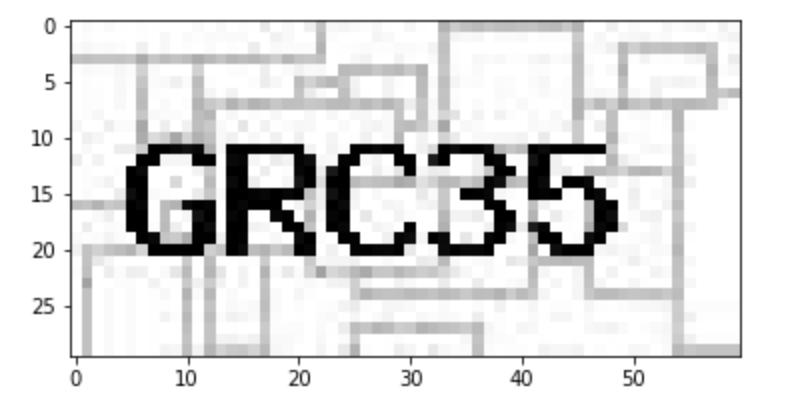
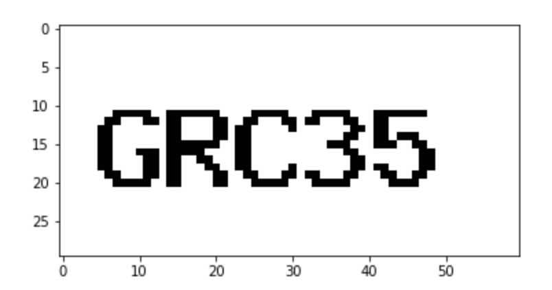

# Read CAPTCHAS By Machine


## Project Introduction

CAPTCHA (Completely Automated Public Turing test to tell Computers and Humans Apart) is a type of security measure used to protect websites from malicoious spam and web-bots. In this assignment, the captchas are images which contains exactly 5 characters with same font, font size, spacing, colour and structures etc. 

There are two sets of imagery provoided: 

 ┣ 📂sampleCaptchas
 ┃ ┣ 📂input
 ┃ ┣ 📂output

Here we have 26 images stored in the input folder, among which 25 images have their labels in the output folder, and 1 image ("input100.jpg") for me to predict its content. 


## Project Directory

```
📦text_recognition_1
 ┣ 📂.git
 ┣ 📂images
 ┣ 📂sampleCaptchas
 ┃ ┣ 📂cleaned_input
 ┃ ┣ 📂input
 ┃ ┣ 📂model
 ┃ ┣ 📂output
 ┣ 📂src
 ┃ ┣ 📜__init__.py
 ┃ ┣ 📜pre_processing_pipeline.py
 ┃ ┗ 📜predicting_pipeline.py
 ┣ 📂test_src
 ┃ ┗ 📜test_predicting_pipeline.py
 ┣ 📜.gitignore
 ┣ 📜AIS Test 2.docx
 ┣ 📜EDA.ipynb
 ┣ 📜README.md
 ┗ 📜requirements.txt
```

Notes:

- [ ] 📜EDA.ipynb : used to explore and clean the data, subsequently to experiment some modelling ideas. 
- [ ] 📜pre_processing_pipeline.py and 📜predicting_pipeline.py : used to make the final idea into full pipeline.
- [ ] 📜test_predicting_pipeline.py : a simple test case for test image


## Quick Tour

First of all, let's have a look of the original image:



Noticed that the images have three channels and some noise background, we can convert them to single channel grayscale with totally white background for the ease of character recognition later. 



Now, I have this cleaned version of image using otsu algorithm, which is a method to search for the best threshold value to binarize a grayscale image. A short intro about this otsu algorithm, it bascially tries each pixel value, from 0 to 255, to see which value as a threshold can separate the pixel values into two groups with the minimum weighted average of intra variances.

Time for the modelling part. The first idea that came to my mind was OCR. Because this task is indeed just to identify characters from images. So I have tried with the popular python library - pytesseract, it is a wrapper for google's OCR engine, and supports various image types such as jpeg, png, gif etc. 