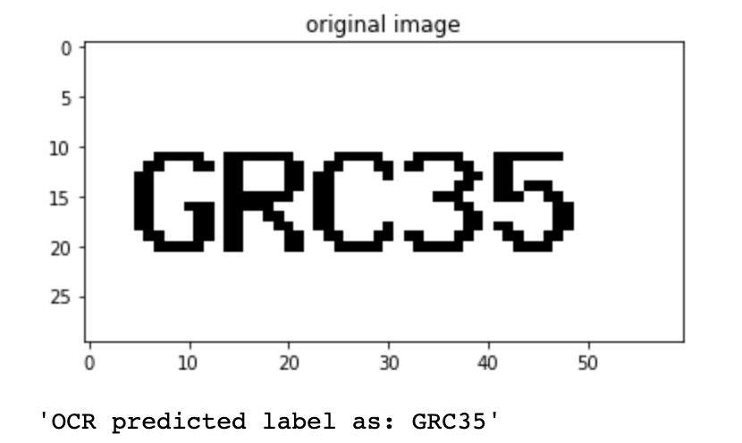
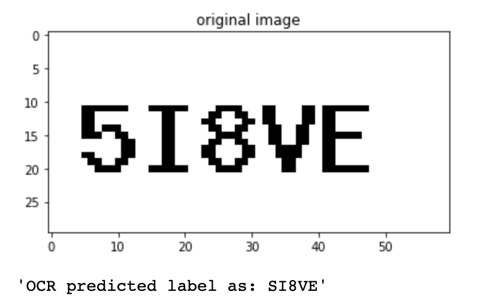
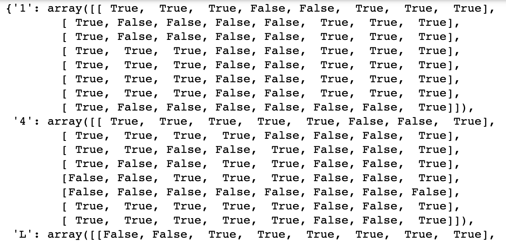
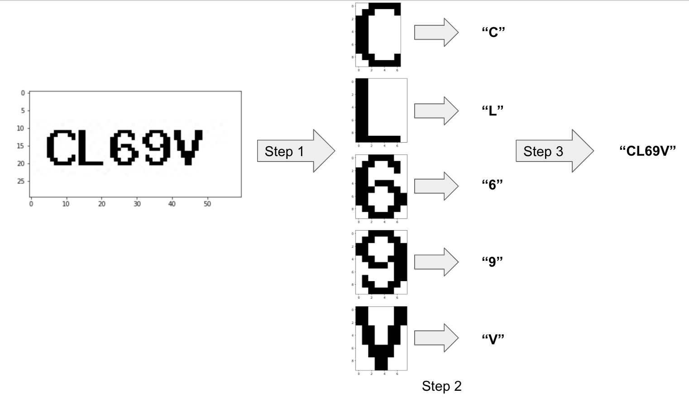

# Read CAPTCHAS By Machine


## Project Introduction

CAPTCHA (Completely Automated Public Turing test to tell Computers and Humans Apart) is a type of security measure used to protect websites from spam or web-bots. In this assignment, the captchas are images which contain exactly 5 characters with same font style, font size, spacing, colour and structure etc. 

There are two sets of imagery provoided: 

>  ```
>  ┣ 📂sampleCaptchas
>  ┃ ┣ 📂input
>  ┃ ┣ 📂output
>  ```

Here we have 26 images stored in the input folder, among which 25 images have their labels in the output folder, and 1 image ("input100.jpg") will be treated as test data. The task is to predict the content in the image using model or algorithm. 


## Project Directory

```
📦text_recognition_1
 ┣ 📂.git
 ┣ 📂images
 ┣ 📂sampleCaptchas
 ┃ ┣ 📂cleaned_input
 ┃ ┣ 📂input
 ┃ ┣ 📂model
 ┃ ┣ 📂output
 ┣ 📂src
 ┃ ┣ 📜__init__.py
 ┃ ┣ 📜pre_processing_pipeline.py
 ┃ ┗ 📜predicting_pipeline.py
 ┣ 📂test_src
 ┃ ┣ 📜__init__.py
 ┃ ┗ 📜test_predicting_pipeline.py
 ┣ 📜.gitignore
 ┣ 📜AIS Test 2.docx
 ┣ 📜EDA.ipynb
 ┣ 📜README.md
 ┗ 📜requirements.txt
```

Notes:

- [ ] 📜EDA.ipynb : used to explore and clean the data, in addition, to experiment some modelling ideas. 
- [ ] 📜pre_processing_pipeline.py and 📜predicting_pipeline.py : used to make the final idea into automated pipeline.
- [ ] 📜test_predicting_pipeline.py : a simple test case to validate our data pipeline


## Quick Tour

First of all, let's take a look at the original image:


Noticed that the original image is a three-channel RGB with some noise in the background, for the ease of character recognition, we can first convert it to a single-channel grayscale with totally white background . 


Now, I've got this cleaned version of image using otsu algorithm, which is a method to search for the best threshold value to binarize a grayscale image. A short intro about this otsu algorithm, it bascially tries each pixel value, from 0 to 255, to see which value as a threshold can separate the pixel values into two groups with the minimum weighted average of intra variances.

Time for the modelling part. The first idea that came to my mind was OCR. Because this task is indeed just to identify characters from images. Thus I have tried with the popular python library - pytesseract, it is a wrapper for google's OCR engine, and supports various image types, such as jpeg, png, gif etc. 

With the tesseract model, I have tested on some images. Well, the result was pretty good considering that we did not feed the model with any of our images, it can predict most of the characters and digits correct (credits go to the good quality of the original images) 



But errors were expected, the example below shows OCR model recognised "5" as "S", this is quite easy to understand as both "5" and "S" do look alike. There seems to be some room for improvement still.



Next, I tried to train my own OCR model with 25 images, erm... I knew the data size was too small for a data-hungry monster like neural network. But I guess no harm to try and check the result out. So here we go with a Keras-based RNN model. The result on the validation set was super poor. Since I am not an expert on computer vision, I tried to validate the model with the Keras tutorial dataset, instead of feeding the original thousands of images, I trained the model with 25 images. As a consequence, it performed as bad as mine (see the image below). Therefore, I have decided to skip this episode. 


Lastly, I tried with pixel matching - the simplest and most brute-force way. As all the characters have same font size and same structure, I first cropped each character in the original image to an individual rectangular shape, which I named it as a token. Then converted the token to an image hash using "imagehash" libraray. Subsequently, I stored all the image hashes to a python dictionary, where the key is the label and value is the hash. Here, you may wonder what is the hash of an image? Well, image hash was derived with a few steps below:

1. reduce the size of raster image.
2. get the mean value of all pixel values in the image.
3. take the boolean of each pixel by comparing each pixel value with the mean.

Now take a glimpse at this dictionary of image hash, each hash is bascially a 2-dimensional array of boolean values.



This image hash has one great feature - it supports mathematical subtraction and the resulted difference represents the dissimilarity between two images.  e.g. hash of char "L" - hash of char "L" = 0, while hash of char "L" - hash of char "A" = 8. With this dictionary of image hashes, we can easily get the label of any image in this project!

Here let me briefly illustrate the predicting pipeline: step 1 bascially decomposes the CAPTCHA image into individual character/toekn, step 2 applies the dictionary of image hashes to search for the most similar character, step 3 joins all the predicted labels together and return the label. That's it.  




## Install Dependencies

open terminal, and type:

```bash
cd /project/root/path/
```

```bash
pip install -r ./requirements.txt
```


## Try Predicting Pipeline

open terminal, and type:

```bash
PYTHONPATH="/project/root/path/" python -m src.predicting_pipeline
```

or you may run test case:

```bash
PYTHONPATH="/project/root/path/" pytest test_src/
```

alternatively, it is more convenient to run the pipeline in IDE. Good luck and have fun: )


## Reference: 

- tesserect: 
https://stackoverflow.com/a/51583635  
https://www.geeksforgeeks.org/text-detection-and-extraction-using-opencv-and-ocr/ 

- RGB image:
https://stackoverflow.com/a/52307690

- Keras OCR: 
https://keras.io/examples/vision/captcha_ocr/

- image hash:
https://github.com/JohannesBuchner/imagehash

- otsu algorithm:
http://www.labbookpages.co.uk/software/imgProc/otsuThreshold.html#:~:text=Otsu's%20thresholding%20method%20involves%20iterating,fall%20in%20foreground%20or%20background. 